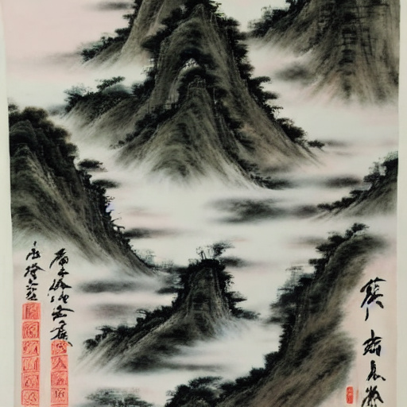

# mnn-stable-diffusion

## Usage

### 1. Compile MNN library
#### Linx/Mac
```bash
git clone https://github.com/alibaba/MNN.git
cd MNN
mkdir build
cmake -DMNN_BUILD_OPENCV=ON -DMNN_IMGCODECS=ON ..
make -j8
cp libMNN.so express/libMNN_Express.so tools/cv/libMNNOpenCV.so /path/to/stable-diffusion-mnn/libs
```

#### Windows
```bash
# Visual Studio xxxx Developer Command Prompt
powershell
git clone https://github.com/alibaba/MNN.git
cd MNN
mkdir build
cmake -G "Ninja" -DMNN_BUILD_OPENCV=ON -DMNN_IMGCODECS=ON ..
ninja
cp MNN.dll MNN.lib /path/to/stable-diffusion-mnn/build
```

### 2. Download Models
Download models from `github release` to `/path/to/mnn-stable-diffusion/resource`
```bash
cd resource
wget https://github.com/wangzhaode/mnn-stable-diffusion/releases/download/v0.1/text_encoder.mnn
wget https://github.com/wangzhaode/mnn-stable-diffusion/releases/download/v0.1/vae_decoder.mnn
wget https://github.com/wangzhaode/mnn-stable-diffusion/releases/download/v0.1/unet.mnn
```

### 2. Build and Run

#### Linux/Mac
```bash
mkdir build
cd build
cmake ..
make -j4
./main "飞流直下三千尺，疑是银河落九天，唐诗，水墨，国画。" demo.jpg
[##################################################]  [100%] [iter time: 411.441000 ms]
SUCCESS! write to demo.jpg
```
#### Windows
```bash
# Visual Studio xxxx Developer Command Prompt
powershell
mkdir build
cd build
cmake -G "Ninja" ..
ninja
./main "飞流直下三千尺，疑是银河落九天，唐诗，水墨，国画。" demo.jpg
[##################################################]  [100%] [iter time: 411.441000 ms]
SUCCESS! write to demo.jpg
```
#### Android
```bash
mkdir build
cd build
../android_build.sh
adb push main ../libs/*.so /data/local/tmp/
adb push ../resource /data/local/tmp/
adb shell
cd /data/local/tmp/
./main "飞流直下三千尺，疑是银河落九天，唐诗，水墨，国画。" demo.jpg
[##################################################]  [100%] [iter time: 411.441000 ms]
SUCCESS! write to demo.jpg
```



## Speed

|     device     | speed (ms/iter) |
|----------------|-----------------|
|   RTX 3060Ti   |       421       |
| Core i7-13700K |      15985      |


## Promot
- 不要使用中文标点。（Don't use Chinese punctuation marks, such as commas and periods.）
- 给出画的属性。(Give the painting some attributes.)

## Ref
https://huggingface.co/IDEA-CCNL/Taiyi-Stable-Diffusion-1B-Chinese-v0.1
